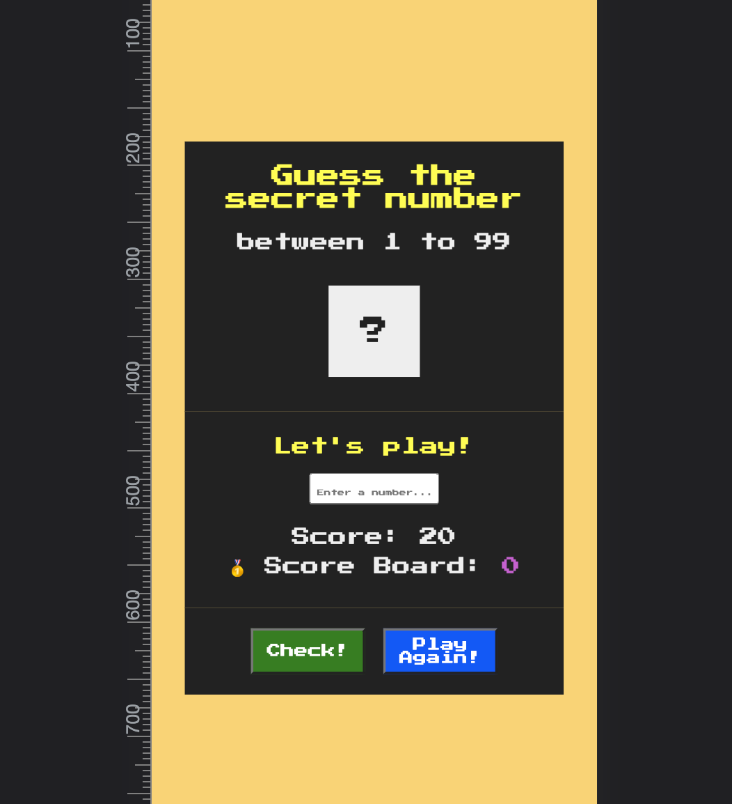
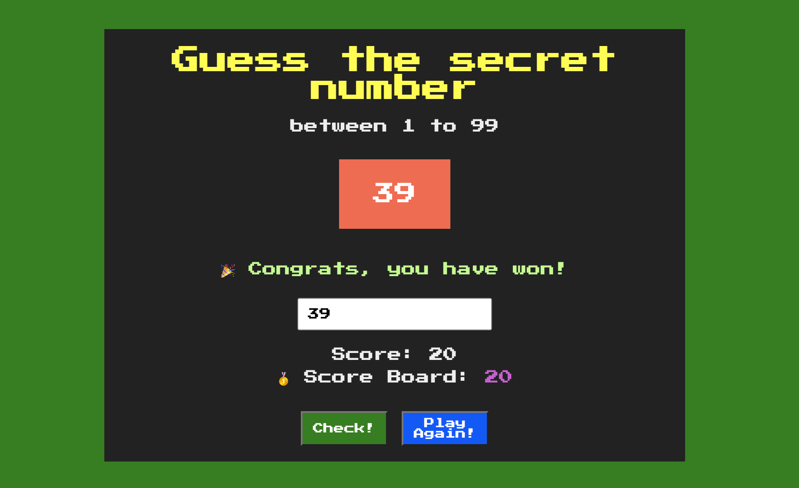
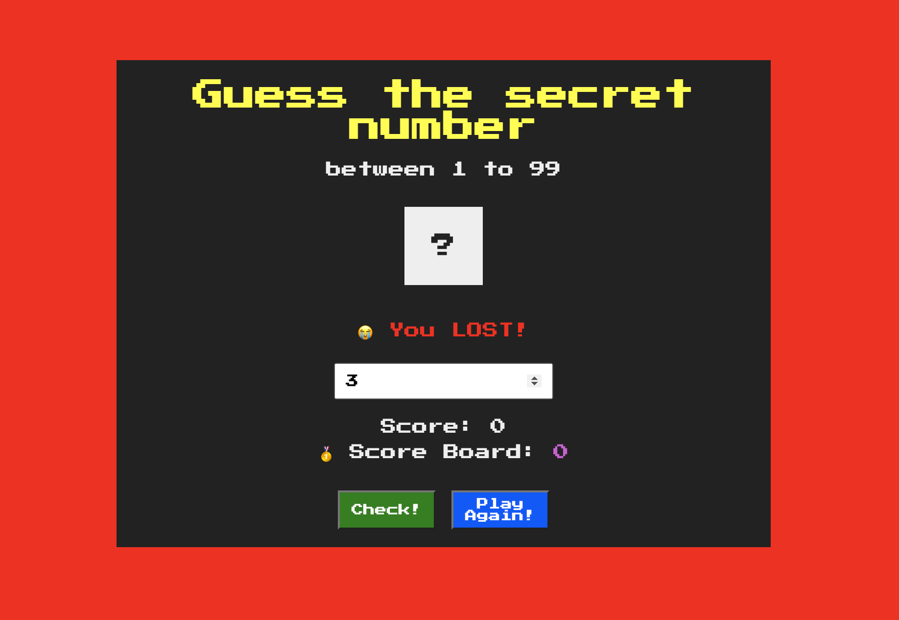
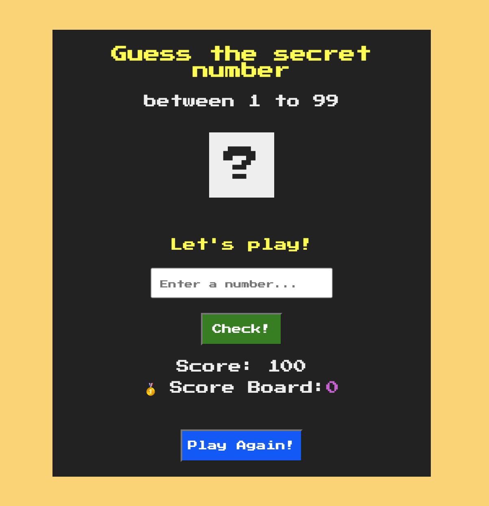

# A guessing game coded in vanilla JavaScript

# How to play
- Guess the right number from 1 to 99 in 10 attempts
- Score starts with 100 points
- Every wrong guess will result negative 10 points deducted from score
- To win this game, winer must guess the correct number within 10 times, and only the highest score will be displayed on dashboard
- Fail to find the correct number and running out of guesses in 10 attempts will result a loss in this game.
- Hit Play again button to restart the game
* Hint: divide and conquer is the way to win

# Mobile first design

# Intial design on website

# Revised design

# When users win the game

# When users lose the game

# UX improvement

