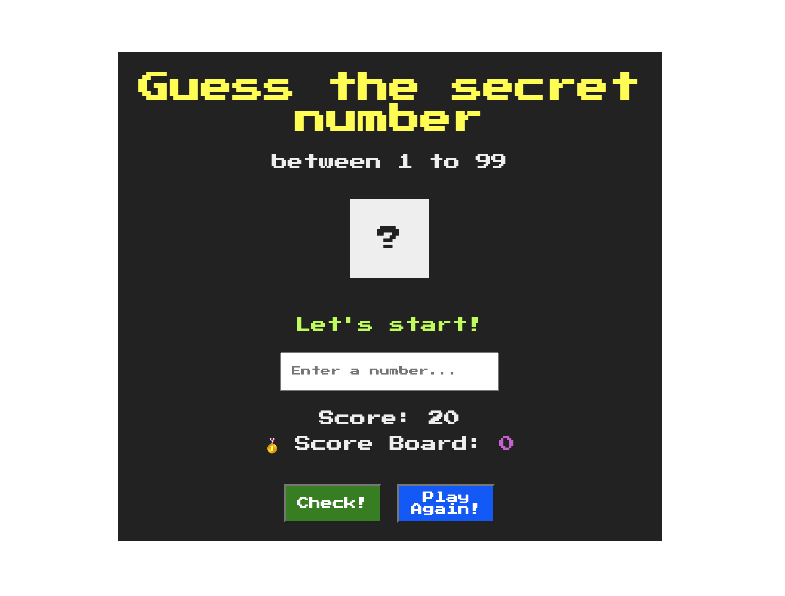
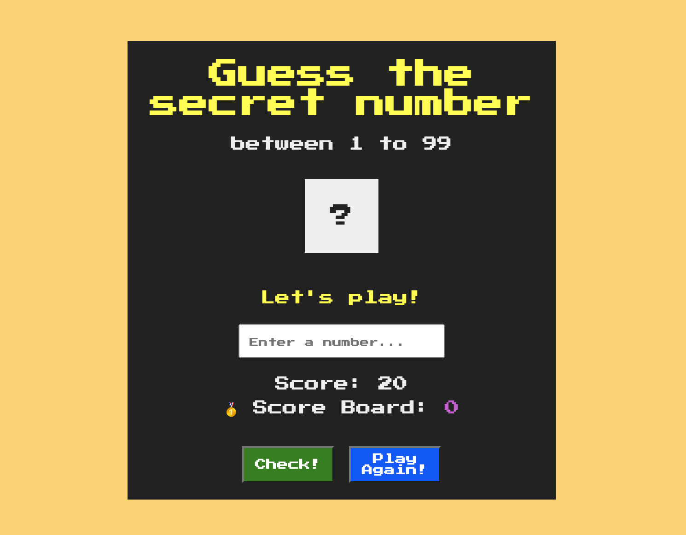

# A guessing game coded in vanilla JavaScript

# How to play
- Guess the right number from 1 to 99 in 20 attempts
- Score starts with 20 points, each point represents each guess times
- Every wrong guess will result a negative 1 point deducted from score
- To win this game, winer must guess the correct number within 20 times, and only the highest score will be displayed on dashboard
- Fail to find the correct number and running out of guesses in 20 attempts will result a loss in this game.
- Hit Play again button to restart the game

# Mobile first design

# Intial design on website

# Revised design

# When users win the game

# When users lose the game

